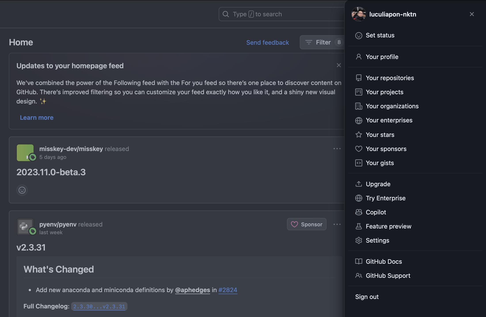
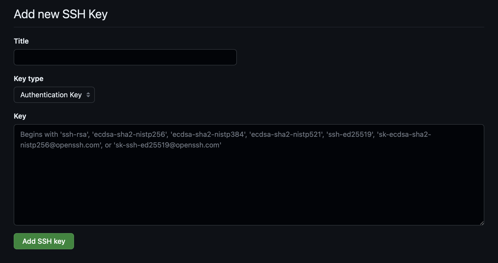
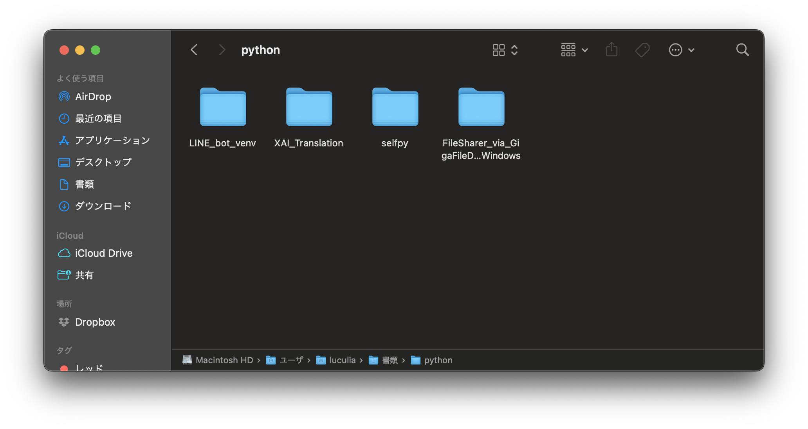
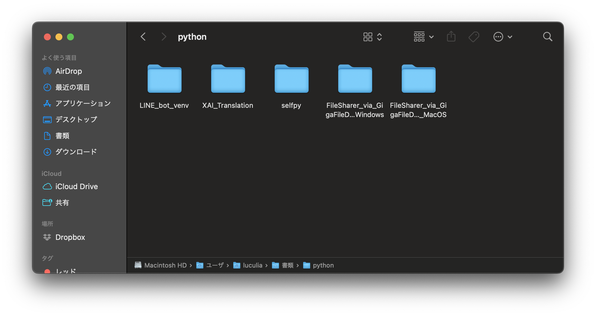
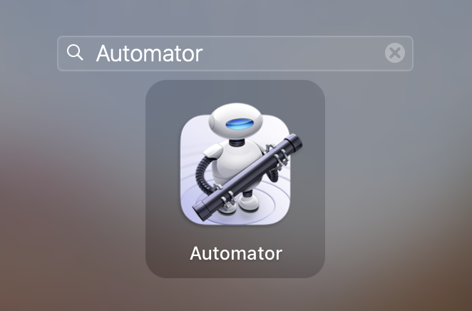
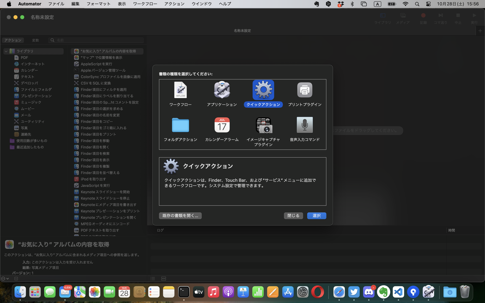
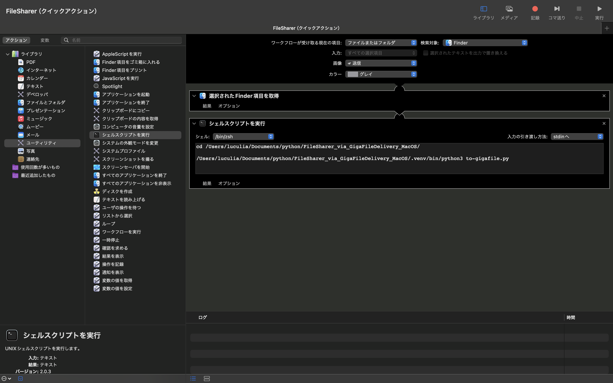
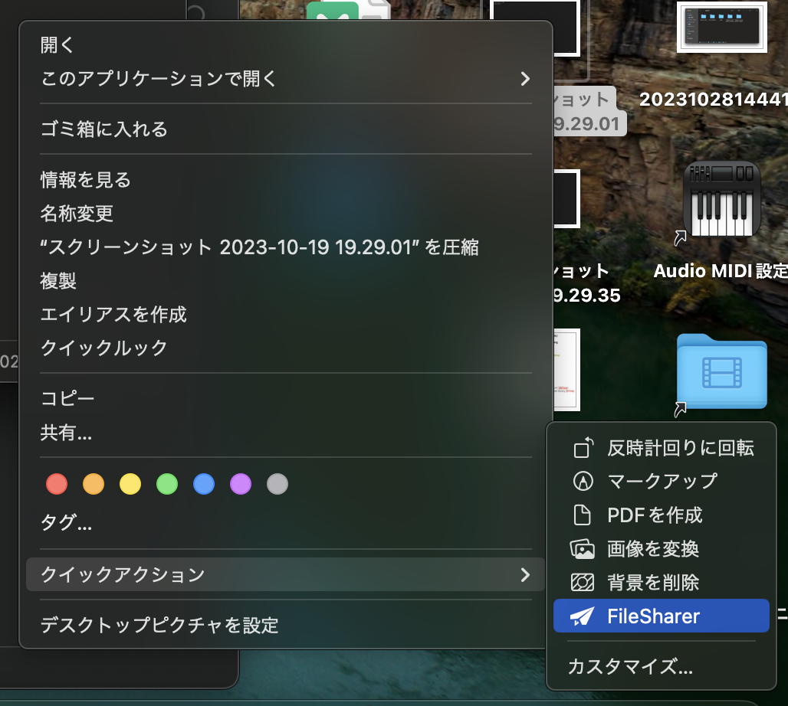

# FileSharer_via_GigaFileDelivery_MacOS
ファイルをギガファイル便にアップロードして、ダウンロードURLを自動的に返してくれるサービス。  
Finderのファイルを右クリックするとクイックアクションからアップロードしてくれます。  

## できないこと
・一度に複数のファイルをアップロードし、複数のファイルのダウンロードURLをクリップボードにコピーする  
・一度に複数のファイルをアップロードし、ひとつにまとめられたZipファイルのダウンロードURLをクリップボードにコピーする  
・削除キーの取得  
・ファイル保持期間変更（デフォルトでは5日）  

## 実行推奨環境
・MacOS Sonoma 14.0 以上  
・Visual Studio Code 1.83.1 以上  
・git 2.39.3 以上  
・Python 3.10.5 以上  
・Poetry 1.6.1 以上  
・pyenv 2.3.30 以上  
・Automator 2.10 以上  
・(Homebrew 4.1.17 以上)  

## 環境構築のための準備
__ここでは基本的なことしか述べていないので、わかる人は「環境構築」まで読み飛ばしても構いません。__
1. Viaual Studio Codeのインストール  
   下記URLよりインストーラーをダウンロードして、インストールを実行してください。  
   https://code.visualstudio.com/download
2. Pythonのバージョン確認  
   ターミナルを開いて下記コマンドを実行してください。  
   ```
   python --version
   ```
   下記のように表示されれば正常にインストールされているので、4及び5はスキップして構いません。  
   （ぶっちゃけバージョンはPython3であればたぶん動くと思うので、なんでもいいです。）  
   ```
   python 3.10.5
   ```
   もし、Pythonがインストールされていなければ下記コマンドのようになるので、Pythonをインストールするために3〜5に進みましょう。
   ```
   command not found: python
   ```
3. Homebrewのインストール  
   ターミナルを開いて下記コマンドを実行してください。  
   Homebrewのインストールはこの後の4及び6を実行するのに必要です。
   ```
   /bin/bash -c "$(curl -fsSL https://raw.githubusercontent.com/Homebrew/install/HEAD/install.sh)"
   ```
   [Homebrew公式](https://brew.sh)  
   M1Macの場合、更に下記の２つのコマンドを実行してください。
   ```
   echo 'eval "$(/opt/homebrew/bin/brew shellenv)"' >> ~/.zshrc
   ```
   ```
   source ~/.zshrc
   ```
   最後に下記コマンドを実行してHomebrewがインストールできているか確認しましょう。
   ```
   brew -v
   ```
4. （pyenvのインストール）  
   ターミナルを開いて下記コマンドを実行してください。
   ```
   brew install pyenv
   ```
   下記コマンドを実行してpyenvがインストールできているか確認しましょう。
   ```
   pyenv --version
   ```
   最後にpyenvの設定を行います。下記の4つのコマンドを実行してください。
   ```
   echo 'export PYENV_ROOT="$HOME/.pyenv"' >> ~/.zshrc
   ```
   ```
   echo 'export PATH="$PYENV_ROOT/bin:$PATH"' >> ~/.zshrc
   ```
   ```
   echo 'eval "$(pyenv init -)"' >> ~/.zshrc
   ```
   ```
   source ~/.zshrc
   ```
5. （Pythonのインストール）  
   ターミナルを開いて下記コマンドを実行してください。
   ```
   pyenv install --list
   ```
   下記のようにインストールできるPythonバージョンのリストが一覧表示されます。
   ```
   2.1.3
   2.2.3
   2.3.7
   …
   （中略）
   …
   3.11.5
   3.11.6
   3.12.0
   ```
   今回は3.10.5をインストールしようと思います。
   ターミナルにて下記コマンドを実行してください。
   ```
   pyenv install 3.10.5
   ```
7. Gitのインストール  
   ターミナルを開いて下記コマンドを実行してください。
   ```
   git --version
   ```
   バージョンが表示されれば無事インストールされているのでこの工程はスキップして構いません。
   エラー表示が出れば、未インストールなので下記コマンドを引き続きターミナルで実行しましょう。
   ```
   brew install git
   ```
   もう一度下記コマンドを実行してバージョン情報が表示されたらインストール完了です。
   ```
   git --version
   ```
8. Poetryのインストール  
   Poetryはたぶんデフォルトではインストールされていないと思うのでターミナルにて下記コマンドを実行しましょう。
   ```
   curl -sSL https://install.python-poetry.org | python -
   ```
   次に下記コマンドを実行。your_user_nameのところはあなたのPCの名前に置き換えてください。
   ```
   echo 'export PATH="/Users/your_user_name/.local/bin:$PATH"' >> ~/.zshrc
   ```
   ```
   source ~/.zshrc
   ```
   ターミナルにて下記コマンドを実行して正常にバージョン情報が表示されたらインストール完了です。
   ```
   poetry --version
   ```
   最後にPoetryの設定を変更しておきましょう。
   ```
   poetry config virtualenvs.in-project true
   ```
   これで作業ディレクトリ内に.venvファイルを生成することができるようになります。
9. GitHubアカウントの登録  
   下記URLにてGitHubアカウントを登録してください。  
   https://github.co.jp

   このままではまだGitでの操作はできません。ターミナルにて下記コマンドを実行しましょう。
   ```
   cd ~/.ssh
   ```
   ```
   ssh-keygen -t rsa
   ```
   すると、下記のような３つの質問をされます。何も入力せずに３回Return(Enter)キーを押しましょう。
   ```
   Generating public/private rsa key pair.
   Enter file in which tosave the key (/Users/your_user_name/.ssh/id_rsa):
   Enter passphrase (empty for no passphrase):
   Enter same passphrase again:
   ```
   Finderで/Users/your_user_name/.ssh/に移動してみましょう。  
   （Macでは.sshフォルダは非表示化されています。なのでFinderの 移動>フォルダに移動 でフォルダパスを指定して移動すると良いです。）  
   id_rsa（秘密鍵）とid_rsa.pub（公開鍵）が生成されていることがわかります。  
   id_rsa.pub（公開鍵）をVisual Studio Codeで開いてみましょう。  
   何かしらの暗号のような文字列が一行目に表示されているのがわかります。  
   これを全選択(command+A)してコピー(command+C)しましょう。  

   GitHubアカウントに戻ります。  
   
   Dashboardに行くと右上にアカウントアイコンが表示されているのでクリックします。メニューが開くのでSettingsを選択します。  
   左のメニューバーから Access > SSH and GPG keys を選択します。  
   __New SSH key__ をクリックしましょう。  
   
   Titleは何でもいいです。Key typeはAuthentication keyのままで大丈夫です。  
   Keyは先ほどコピーしたid_rsa.pub（公開鍵）の暗号のような文字列をそのままペーストします。  
   最後に __Add SSH key__ をクリックして保存します。  
   すると、新しく鍵マークのSSHが生成されているのがわかります。

## 環境構築
1. git cloneする  
   まずはFinderでFileSharerを保存するための適当なディレクトリにあたりをつけてください。  
   
   今回、筆者は/Users/your_user_name/Documents/pythonというディレクトリを作成し、この中にFileSharer_via_GigaFileDelivery_MacOSを保存します。  
   Visual Studio Codeを開きましょう。ターミナル > 新しいターミナル を選択します。  
   画面下部にターミナルが出現しました。出現したターミナルにて下記コマンドを実行しましょう。
   ```
   cd /Users/your_user_name/Documents/python
   ```
   先ほどあたりをつけたディレクトリに移動することができました。
   次に下記コマンドを実行してgit cloneしましょう。
   ```
   git clone git@github.com:luculiapon-nktn/FileSharer_via_GigaFileDelivery_MacOS.git
   ```
   完了したらFinderで確認してみます。
   
   git cloneできたことが確認できました。
2. パッケージをインストールする  
   Visual Studio Codeを開きましょう。  
   ファイル > フォルダを開く から先ほど作ったgit cloneしてきたローカルリポジトリを開きましょう。  
   ターミナル > 新しいターミナル で下記コマンドを実行してください。  
   ```
   poetry shell
   ```
   仮想環境の中に入ることができました。また、ローカルリポジトリの中に.venvファイルが生成されていることが確認できます。
   次にターミナルにて下記コマンドを実行して必要なパッケージをインストールします。
   ```
   poetry install
   ```
4. Plyerパッケージのコードを一部書き換える  
   左のエクスプローラーからディレクトリの構成が見れるはずです。以下のファイルパスのnotification.pyをVisual Studio Codeで開きます。
   ```
   /Users/luculia/Documents/python/FileSharer_via_GigaFileDelivery_MacOS/.venv/lib/python3.10/site-packages/plyer/platforms/macosx/notification.py
   ```
   notification.pyのコードを全選択(command+A)して、Back Spaceで記述内容を一度削除します。  
   notification.pyを以下のコードで上書きします。  
   ```
   '''
   Module of MacOS API for plyer.notification.
   '''
   
   from plyer.facades import Notification
   
   import os
   
   class OSXNotification(Notification):
       '''
       Implementation of MacOS notification API.
       '''
   
       def _notify(self, **kwargs):
           title = kwargs.get('title', '')
           message = kwargs.get('message', '')
           app_name = kwargs.get('app_name', '')
           sound_name = 'default'
           # app_icon, timeout, ticker are not supported (yet)
   
           title_text = f'with title "{title}"' if title != '' else ''
           subtitle_text = f'subtitle "{app_name}"' if app_name != '' else ''
           soundname_text = f'sound name "{sound_name}"'

           notification_text = f'display notification "{message}" {title_text} {subtitle_text} {soundname_text}'
           os.system(f"osascript -e '{notification_text}'")

   def instance():
       '''
       Instance for facade proxy.
       '''
       return OSXNotification()
   ```
   command+Sで上書き保存してください。

## Automatorを設定する
AutomatorとはMacOSに組み込まれている標準のアプリケーションです。これを使ってローカルリポジトリにあるPythonファイルを実行します。  
1. Automatorを開く
   Launchpadの画面上部にある検索バーに「Automator」と入力します。  
     
   Automatorを開きましょう。  
   ウインドウ左下の新規書類を選択します。  
     
   「クイックアクション」を選択しましょう。
2. Automatorの設定をする  
   左の ライブラリ > ファイルとフォルダ > 選択されたFinder項目を取得 をダブルクリックしてアクションを配置しましょう。  
   次に ライブラリ > ユーティリティ > シェルスクリプトを実行 をダブルクリックしてアクションを配置しましょう。  
     
   シェルククリプトコマンドには以下コマンドを書き込みます。
   ```
   cd /Users/your_user_name/Documents/python/FileSharer_via_GigaFileDelivery_MacOS/
   /Users/your_user_name/Documents/python/FileSharer_via_GigaFileDelivery_MacOS/.venv/bin/python3 to-gigafile.py
   ```
   他の設定項目は上記画像を参考にしてください。  
   command+Sで保存します。  
   タイトルは任意でいいです。保存場所はiCloudが無難でいいでしょう。  

## 実行
任意のファイルを選択して右クリックしてください。クイックアクションの中に先ほどAutomatorで設定した項目が追加されています。  
  
これを実行するとバックグラウンドでWebブラウザにアクセスし、ギガファイル便のダウンロードURLが自動的にクリップボードにコピーされます。  

## Gitの接続を切断
最後にVisual Studio Codeのターミナルでローカルリポジトリを開き、下記コマンドを実行して、Gitとの接続を切断してください。  
```
rm -rf .git/
```
